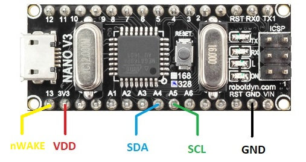

# CCS811
Arduino library for the CCS811 digital gas sensor for monitoring indoor air quality from ams.

## Introduction
This project is an Arduino *library*. It implements a driver for the CCS811.
This chip is a indoor air quality sensor module with an I2C interface.

The code has been tested with
 - [NodeMCU (ESP8266)](https://www.aliexpress.com/item/NodeMCU-V3-Lua-WIFI-module-integration-of-ESP8266-extra-memory-32M-flash-USB-serial-CP2102/32779738528.html)
 - [Arduino pro mini](https://www.aliexpress.com/item/ProMini-ATmega328P-3-3V-Compatible-for-Arduino-Pro-Mini/32525927539.html)
 - [Arduino nano](https://www.aliexpress.com/item/Nano-CH340-ATmega328P-MicroUSB-Compatible-for-Arduino-Nano-V3/32572612009.html)

Note that the CCS811 requires a supply voltage of 1.8V .. 3.6V.
So, 3.3V is ok, but *do not use a 5V board*.
The Nano has 3v3 supply, but runs I2C on 5V. This does seem to work.
Also note that the minimum supply voltage is 1.8V and should not drop below this value for reliable device operation.

## Links
The CCS811 is made by [ams](http://www.ams.com). This library is compatible with the following variants.
 - Find the datasheet of the CCS811 on the
   [product page](http://ams.com/eng/Products/Environmental-Sensors/Air-Quality-Sensors/CCS811).
 - Find application notes and software on the
   [download page](https://download.ams.com/ENVIRONMENTAL-SENSORS/CCS811).

## Prerequisites
It is assumed that
 - The Arduino IDE has been installed.
   If not, refer to "Install the Arduino Desktop IDE" on the
   [Arduino site](https://www.arduino.cc/en/Guide/HomePage).
 - The library directory is at its default location.
   For me, Maarten, that is `C:\Users\maarten\Documents\Arduino\libraries`.

## Installation
Installation steps
 - Visit the [project page](https://github.com/maarten-pennings/CCS811) for the Arduino CCS811 library.
 - Click the green button `Clone or download` on the right side.
 - From the pop-up choose `Download ZIP`.
 - Unzip the file "Here", so that this `README.md` is in the top-level directory
   with the name `CCS811-master`.
 - Rename the top-level directory `CCS811-master` to `CCS811`.
 - Copy the entire tree to the Arduino library directory.
   This `README.md` should be located at e.g.
   `C:\Users\maarten\Documents\Arduino\libraries\CCS811\README.md`.

## Build an example
To build an example sketch
 - (Re)start Arduino.
 - Open File > Example > Examples from Custom Libraries > CCS811 > CCS811demo.
 - Make sure Tools > Board lists the correct board.
 - Select Sketch > Verify/Compile.

## Wiring
This library has been tested with three boards.

For the NodeMCU (ESP8266), connect as follows (I did not use pull-ups, presumably they are inside the MCU)

| CCS811  |  ESP8266  |
|:-------:|:---------:|
|   VDD   |    3V3    |
|   GND   |    GND    |
|   SDA   |    D2     |
|   SCL   |    D1     |
| nWAKE   | D3 or GND |


For the Pro mini (do *not* use a 5V board), connect as follows  (I did not use pull-ups, presumably they are inside the MCU)

| CCS811  |  Pro mini |
|:-------:|:---------:|
|   VDD   |    VCC    |
|   GND   |    GND    |
|   SDA   |     A4    |
|   SCL   |     A5    |
| nWAKE   | D3 or GND |


For the Arduino Nano, connect as follows  (I did not use pull-ups, presumably they are inside the MCU)

| CCS811  |    Nano   |
|:-------:|:---------:|
|   VDD   |    3V3    |
|   GND   |    GND    |
|   SDA   |     A4    |
|   SCL   |     A5    |
| nWAKE   | D3 or GND |



Connect the CCS811 module as follows


## Flash an example
To build an example sketch
 - (Re)start Arduino.
 - Open File > Example > Examples from Custom Libraries > CCS811 > CCS811demo.
 - In `setup()` make sure to start the I2C driver correctly.
   For example, for ESP8266 NodeMCU have
     ```C++
     // Enable I2C for ESP8266 NodeMCU boards [VDD to 3V3, GND to GND, SDA to D2, SCL to D1]
     Wire.begin(D2,D1); 
     Wire.setClockStretchLimit(1000); 
     ```
   and for Arduino pro mini or Nano have
     ```C++
     // Enable I2C for Arduino pro mini or Nano [VDD to VCC/3V3, GND to GND, SDA to A4, SCL to A5]
     Wire.begin(); 
     ```
 - Make sure Tools > Board lists the correct board.
 - Select Sketch > Upload.
 - Select Tools > Serial Monitor.
 - Enjoy the output, which should be like this for `CCS811demo`:

     ```Text
     Starting CCS811 simple demo
     init: I2C up
     init: CCS811 up
     init: CCS811 started
     CCS811: eco2=65021 ppm,  tvoc=65021 ppb,  errstat=0--vhxmrwf--ad-ie=ERROR|OLD,  raw=0 6uA/10ADC
     CCS811: eco2=400 ppm,  tvoc=0 ppb,  errstat=98--vhxmrwF--AD-ie=VALID&NEW,  raw=3649 6uA/10ADC
     CCS811: eco2=400 ppm,  tvoc=0 ppb,  errstat=98--vhxmrwF--AD-ie=VALID&NEW,  raw=3651 6uA/10ADC
     CCS811: eco2=406 ppm,  tvoc=0 ppb,  errstat=98--vhxmrwF--AD-ie=VALID&NEW,  raw=3649 6uA/10ADC
     CCS811: eco2=410 ppm,  tvoc=1 ppb,  errstat=98--vhxmrwF--AD-ie=VALID&NEW,  raw=3647 6uA/10ADC
     CCS811: eco2=414 ppm,  tvoc=2 ppb,  errstat=98--vhxmrwF--AD-ie=VALID&NEW,  raw=3646 6uA/10ADC
     CCS811: eco2=679 ppm,  tvoc=42 ppb,  errstat=98--vhxmrwF--AD-ie=VALID&NEW,  raw=3516 6uA/10ADC
     CCS811: eco2=501 ppm,  tvoc=15 ppb,  errstat=98--vhxmrwF--AD-ie=VALID&NEW,  raw=3588 6uA/10ADC
     CCS811: eco2=415 ppm,  tvoc=2 ppb,  errstat=98--vhxmrwF--AD-ie=VALID&NEW,  raw=3640 6uA/10ADC
     CCS811: eco2=709 ppm,  tvoc=47 ppb,  errstat=98--vhxmrwF--AD-ie=VALID&NEW,  raw=3506 6uA/10ADC
     CCS811: eco2=418 ppm,  tvoc=2 ppb,  errstat=98--vhxmrwF--AD-ie=VALID&NEW,  raw=3638 6uA/10ADC
     CCS811: eco2=400 ppm,  tvoc=0 ppb,  errstat=98--vhxmrwF--AD-ie=VALID&NEW,  raw=2464 6uA/10ADC
     CCS811: eco2=400 ppm,  tvoc=0 ppb,  errstat=98--vhxmrwF--AD-ie=VALID&NEW,  raw=2480 6uA/10ADC
     CCS811: eco2=404 ppm,  tvoc=0 ppb,  errstat=98--vhxmrwF--AD-ie=VALID&NEW,  raw=2486 6uA/10ADC
     ```

(end of doc)
