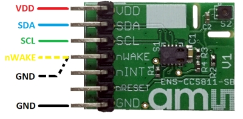

# CCS811
Arduino library for the CCS811 digital gas sensor for monitoring indoor air quality from ams.

## Introduction
This project is an Arduino *library*. It implements a driver for the CCS811.
This chip is a indoor air quality sensor module with an I2C interface.

The code has been tested with
 - [NodeMCU (ESP8266)](https://www.aliexpress.com/item/NodeMCU-V3-Lua-WIFI-module-integration-of-ESP8266-extra-memory-32M-flash-USB-serial-CP2102/32779738528.html)
 - [Arduino pro mini](https://www.aliexpress.com/item/ProMini-ATmega328P-3-3V-Compatible-for-Arduino-Pro-Mini/32525927539.html)
 - [Arduino nano](https://www.aliexpress.com/item/Nano-CH340-ATmega328P-MicroUSB-Compatible-for-Arduino-Nano-V3/32572612009.html)

Note that the CCS811 requires a supply voltage of 1.8V .. 3.6V.
So, 3.3V is ok, but *do not use a 5V board*.
The Nano has 3v3 supply, but runs I2C on 5V. This does seem to work.
Also note that the minimum supply voltage is 1.8V and should not drop below this value for reliable device operation.

## Links
The CCS811 is made by [ams](http://www.ams.com). This library is compatible with the following variants.
 - Find the datasheet of the CCS811 on the
   [product page](http://ams.com/eng/Products/Environmental-Sensors/Air-Quality-Sensors/CCS811).
 - Find application notes and software on the
   [download page](https://download.ams.com/ENVIRONMENTAL-SENSORS/CCS811).

## Prerequisites
It is assumed that
 - The Arduino IDE has been installed.
   If not, refer to "Install the Arduino Desktop IDE" on the
   [Arduino site](https://www.arduino.cc/en/Guide/HomePage).
 - The library directory is at its default location.
   For me, Maarten, that is `C:\Users\maarten\Documents\Arduino\libraries`.

## Installation
Installation steps
 - Visit the [project page](https://github.com/maarten-pennings/CCS811) for the Arduino CCS811 library.
 - Click the green button `Clone or download` on the right side.
 - From the pop-up choose `Download ZIP`.
 - Unzip the file "Here", so that this `README.md` is in the top-level directory
   with the name `CCS811-master`.
 - Rename the top-level directory `CCS811-master` to `CCS811`.
 - Copy the entire tree to the Arduino library directory.
   This `README.md` should be located at e.g.
   `C:\Users\maarten\Documents\Arduino\libraries\CCS811\README.md`.

## Build an example
To build an example sketch
 - (Re)start Arduino.
 - Open File > Example > Examples from Custom Libraries > CCS811 > CCS811demo.
 - Make sure Tools > Board lists the correct board.
 - Select Sketch > Verify/Compile.

## Wiring
This library has been tested with three boards.

For the NodeMCU (ESP8266), connect as follows (I did not use pull-ups, presumably they are inside the MCU)

| CCS811  |  ESP8266  |
|:-------:|:---------:|
|   VDD   |    3V3    |
|   GND   |    GND    |
|   SDA   |    D2     |
|   SCL   |    D1     |
| nWAKE   | D3 or GND |


For the Pro mini (do *not* use a 5V board), connect as follows  (I did not use pull-ups, presumably they are inside the MCU)

| CCS811  |  Pro mini |
|:-------:|:---------:|
|   VDD   |    VCC    |
|   GND   |    GND    |
|   SDA   |     A4    |
|   SCL   |     A5    |
| nWAKE   | D3 or GND |


For the Arduino Nano, connect as follows  (I did not use pull-ups, presumably they are inside the MCU)

| CCS811  |    Nano   |
|:-------:|:---------:|
|   VDD   |    3V3    |
|   GND   |    GND    |
|   SDA   |     A4    |
|   SCL   |     A5    |
| nWAKE   | D3 or GND |


Connect the CCS811 module as follows




## Flash an example
To build an example sketch
 - (Re)start Arduino.
 - Open File > Example > Examples from Custom Libraries > CCS811 > CCS811basic.
 - Make sure Tools > Board lists the correct board.
 - Select Sketch > Upload.
 - Select Tools > Serial Monitor.
 - Enjoy the output, which should be like this for `CCS811basic`:

     ```Text
     Starting CCS811 basic demo
     init: bootloader  version: 1000
     init: application version: 1100
     CCS811: eco2=65021 ppm,  etvoc=65021 ppb,  errstat=0=--vhxmrwf--ad-ie=ERROR|OLD,  raw6=0 uA,  raw10=0 ADC
     CCS811: eco2=0 ppm,  etvoc=0 ppb,  errstat=90=--vhxmrwF--Ad-ie=ERROR|OLD,  raw6=2 uA,  raw10=454 ADC
     CCS811: eco2=0 ppm,  etvoc=0 ppb,  errstat=90=--vhxmrwF--Ad-ie=ERROR|OLD,  raw6=2 uA,  raw10=454 ADC
     CCS811: eco2=400 ppm,  etvoc=0 ppb,  errstat=98=--vhxmrwF--AD-ie=valid&new,  raw6=2 uA,  raw10=453 ADC
     CCS811: eco2=409 ppm,  etvoc=1 ppb,  errstat=98=--vhxmrwF--AD-ie=valid&new,  raw6=2 uA,  raw10=452 ADC
     CCS811: eco2=409 ppm,  etvoc=1 ppb,  errstat=98=--vhxmrwF--AD-ie=valid&new,  raw6=2 uA,  raw10=452 ADC
     CCS811: eco2=411 ppm,  etvoc=1 ppb,  errstat=98=--vhxmrwF--AD-ie=valid&new,  raw6=2 uA,  raw10=452 ADC
     CCS811: eco2=405 ppm,  etvoc=0 ppb,  errstat=98=--vhxmrwF--AD-ie=valid&new,  raw6=2 uA,  raw10=455 ADC
     CCS811: eco2=403 ppm,  etvoc=0 ppb,  errstat=98=--vhxmrwF--AD-ie=valid&new,  raw6=2 uA,  raw10=456 ADC
     CCS811: eco2=403 ppm,  etvoc=0 ppb,  errstat=98=--vhxmrwF--AD-ie=valid&new,  raw6=2 uA,  raw10=456 ADC
     CCS811: eco2=403 ppm,  etvoc=0 ppb,  errstat=98=--vhxmrwF--AD-ie=valid&new,  raw6=2 uA,  raw10=456 ADC
     CCS811: eco2=407 ppm,  etvoc=1 ppb,  errstat=98=--vhxmrwF--AD-ie=valid&new,  raw6=2 uA,  raw10=456 ADC
     CCS811: eco2=407 ppm,  etvoc=1 ppb,  errstat=98=--vhxmrwF--AD-ie=valid&new,  raw6=2 uA,  raw10=456 ADC
     CCS811: eco2=407 ppm,  etvoc=1 ppb,  errstat=98=--vhxmrwF--AD-ie=valid&new,  raw6=2 uA,  raw10=456 ADC
     CCS811: eco2=407 ppm,  etvoc=1 ppb,  errstat=98=--vhxmrwF--AD-ie=valid&new,  raw6=2 uA,  raw10=456 ADC
     CCS811: eco2=411 ppm,  etvoc=1 ppb,  errstat=98=--vhxmrwF--AD-ie=valid&new,  raw6=2 uA,  raw10=455 ADC
     CCS811: eco2=407 ppm,  etvoc=1 ppb,  errstat=98=--vhxmrwF--AD-ie=valid&new,  raw6=2 uA,  raw10=456 ADC
     CCS811: eco2=411 ppm,  etvoc=1 ppb,  errstat=98=--vhxmrwF--AD-ie=valid&new,  raw6=2 uA,  raw10=455 ADC
     CCS811: eco2=407 ppm,  etvoc=1 ppb,  errstat=98=--vhxmrwF--AD-ie=valid&new,  raw6=2 uA,  raw10=456 ADC
     CCS811: eco2=414 ppm,  etvoc=2 ppb,  errstat=98=--vhxmrwF--AD-ie=valid&new,  raw6=2 uA,  raw10=454 ADC
     CCS811: eco2=407 ppm,  etvoc=1 ppb,  errstat=98=--vhxmrwF--AD-ie=valid&new,  raw6=2 uA,  raw10=456 ADC
     CCS811: eco2=407 ppm,  etvoc=1 ppb,  errstat=98=--vhxmrwF--AD-ie=valid&new,  raw6=2 uA,  raw10=456 ADC
     CCS811: eco2=407 ppm,  etvoc=1 ppb,  errstat=98=--vhxmrwF--AD-ie=valid&new,  raw6=2 uA,  raw10=456 ADC
     ```

(end of doc)
